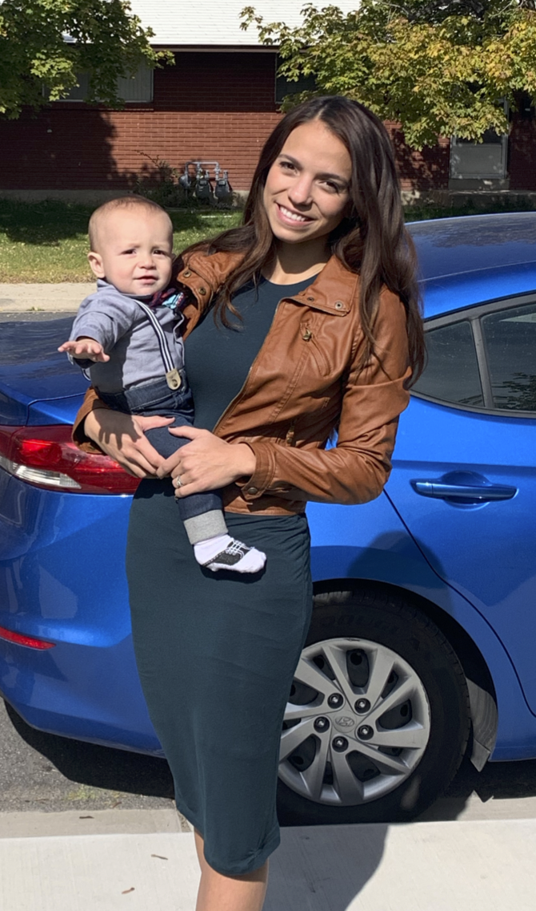

<style type="text/css">
.main-container {
  max-width: 1800px;
  margin-left: auto;
  margin-right: auto;
}
</style>

<style>
div.gray { background-color:#5594A0; border-radius: 5px; padding: 20px;}
</style>
<div class = "gray">


<style>
div.blue { background-color:#61A4B7; border-radius: 5px; padding: 20px;}
</style>
<div class = "blue">
## [HOME](http://KellyTroconis.github.io/) | [ABOUT ME](http://KellyTroconis.github.io/About-me/) | [DATA COURSE](http://KellyTroconis.github.io/data-course/) | [PROJECT](http://KellyTroconis.github.io/PROJECT/)
</div>
___

# **About me**

#### Hey I’m Kelly Cook. I’m a mom, wife and a student. I am a pre-med student at the University of Utah. I am a licensed phlebotomist and medical assistant with aspirations to become a neurosurgeon. I found the inspiration as I grew up in Caracas, Venezuela watching my mom raise me and my two brothers and still have time to become a very well respected thoracic surgeon. 


#### I have been married to my husband, Nathan, for three years (he’s the best). Our son, Achilles, is just over a year old. I love helping others, dancing, listening to stand-up comedy, eating good food and learning/ trying new things. My guilty pleasure is Amazon shopping. I have high expectations for myself and those around me. This girl’s got grit!

<div style= "float:right;position: relative;top:20px">
```{r, out.width = "250px",echo=FALSE}

```
</div>

<br>
</div>
___
<style>
div.gray { background-color:#5594A0; border-radius: 5px; padding: 20px;}
</style>
<div class = "gray">

# **CV**

### **Experience** 

  - Student Researcher - Utah Valley University: Jan ’20 – present
  - Vivint Smart Home – Sales: Mar ’20 – present
  - Grifols - phlebotomist: Sep ’17 - Apr ’18
  - Hope Family Medical Center – medical assistant : Apr ’14 – Nov ’15/ Mar ’17 - Apr ’17
  - Deseret Industries - sales clerk: Aug ’14 – Dec ’14

### **Education** 

   - Associates – Salt Lake City Community College, 2014 - 2018
   - Bachelor of Science – Utah Valley University, 2018 - present 

### **Community Service**

   - Pediatric oncology hospital (Venezuela) -Volunteer: 2012 - 2013
   - LDS mission - New Jersey, 2015 - 2017

### **Clubs**

  - AMWA – American Women’s Medical Association, Vice President, Sept ’19 – present
  - UVU Bachata Club – Performer, Sept ’19 - present


<br>
</div>


